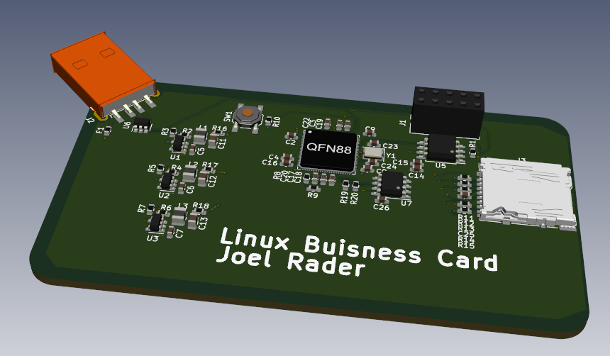

# linux-business-card

A business card that runs Linux! It has a strong focus on security and privacy.

## Components
- F1C100s is the main application processor
- ATECC608A used as the crypto chip
- Micro SD card slot
- Flash memory
